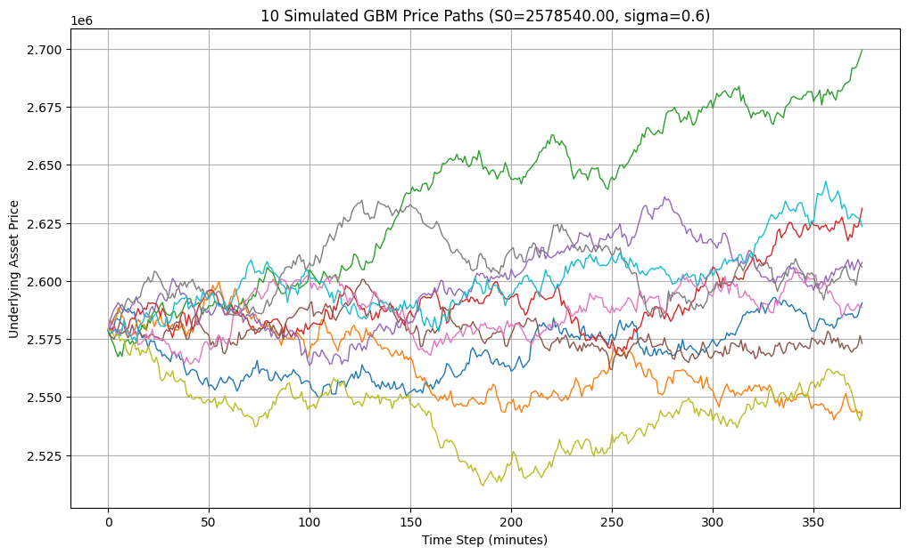
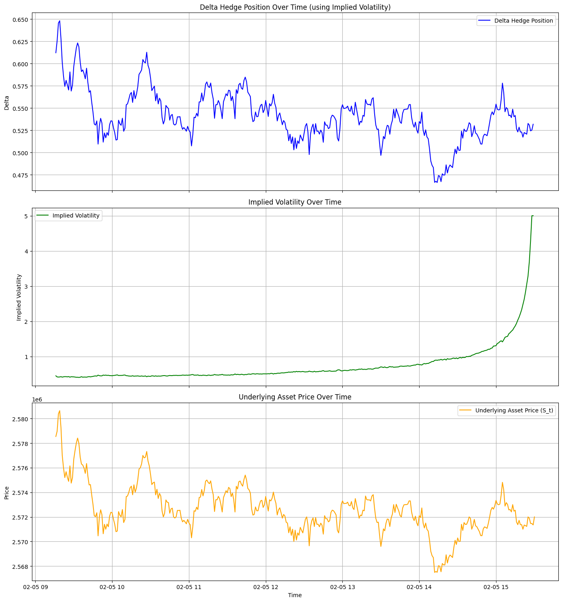
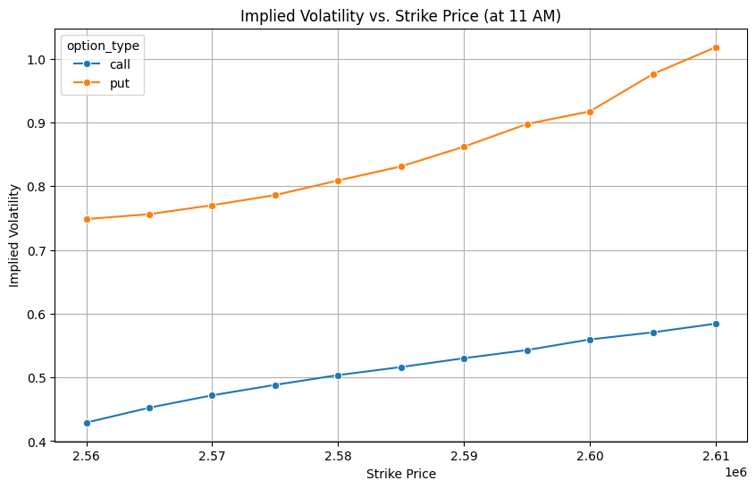
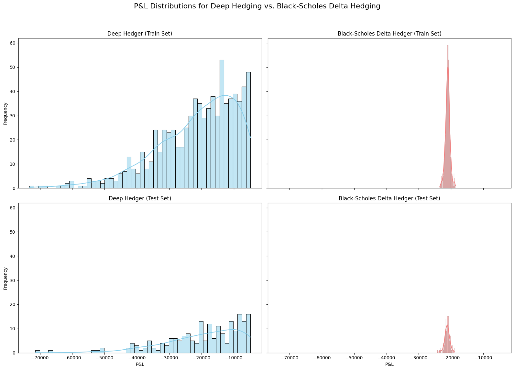

# DeepHedge: Dynamic Delta Hedging for NIFTY Options using Deep Learning

A quantitative finance and deep learning project that implements **dynamic option hedging** for NIFTY options using **Geometric Brownian Motion (GBM)** simulations, **Black-Scholes Greeks**, **Implied Volatility**, and a **Deep Hedging neural network** optimized using **Conditional Value at Risk (CVaR)**.

The project demonstrates how deep learning can learn an optimal hedging strategy that minimizes portfolio tail risk under simulated market conditions.

---

## Project Overview

This project builds an end-to-end deep hedging pipeline for NIFTY options using minute-level market data.

The workflow includes:

- Loading real NIFTY option chain data for **expiry** and **non-expiry** trading days.
- Calculating **Implied Volatility** from observed option prices.
- Computing **Black-Scholes Greeks** (Delta, Gamma, Theta).
- Simulating multiple future asset price paths using **Geometric Brownian Motion (GBM)**.
- Training a **Deep Hedging Model** using TensorFlow.
- Optimizing the hedge using **CVaR Loss** to reduce downside risk.
- Comparing hedge positions and portfolio performance through visualizations.

---

## Repository Structure

```text
DeepHedge/
│── README.md
│── requirements.txt
│
├── data/
│   ├── 20260204_option_minute_prices_non_expiry.csv
│   └── 20260205_option_minute_prices_expiry.csv
│
├── notebooks/
│   └── options_trading_price_prediction.ipynb
│
├── images/
│   ├── Simulated_GBM_Price_Paths.png
│   ├── Delta_Hedging_Results.png
│   ├── Delta_vs_Strike_Price.png
│   ├── Gamma_vs_Strike_Price.png
│   ├── Theta_vs_Strike_Price.png
│   ├── Implied_Volatility_vs._Strike_Price.png
│   └── P&L_Distributions_for_Deep_Hedging_vs._Black-Scholes_Delta_Hedging.png
```

---

## Tech Stack

- **Python**
- **TensorFlow / Keras**
- **NumPy**
- **Pandas**
- **SciPy**
- **Matplotlib**
- **Scikit-learn**
- **Black-Scholes Option Pricing Model**

---

## Dataset

The project uses minute-level **NIFTY option chain data** for two trading sessions.

| Dataset | Description |
|---------|-------------|
| `20260205_option_minute_prices_expiry.csv` | Minute-level NIFTY options and futures prices collected on an expiry trading day. |
| `20260204_option_minute_prices_non_expiry.csv` | Minute-level NIFTY options and futures prices collected on a non-expiry trading day. |

Each dataset contains:

- Trading date
- Minute-level timestamp
- Futures and option symbols
- Last traded price
- Strike price (parsed from option symbol)
- Option type (Call / Put)

---

## Workflow

1. Load minute-level NIFTY option chain data.
2. Filter contracts for a specific observation time (11:00 AM).
3. Extract the underlying NIFTY futures price.
4. Compute **Implied Volatility** using the Black-Scholes model.
5. Calculate **Delta**, **Gamma**, and **Theta** for Call and Put options.
6. Simulate future NIFTY price paths using **Geometric Brownian Motion (GBM)**.
7. Train a **Deep Hedging Neural Network** on simulated paths.
8. Optimize hedge positions using **Conditional Value at Risk (CVaR)**.
9. Evaluate the hedging strategy through portfolio P&L analysis.

---

## Deep Hedging Model

### Inputs

- Underlying asset price.
- Black-Scholes Delta.
- Previous hedge position.

### Output

- Predicted hedge ratio (Delta) at every time step.

### Loss Function

The neural network minimizes **Conditional Value at Risk (CVaR)** of the hedged portfolio, enabling the model to learn hedge positions that reduce extreme downside losses rather than simply minimizing average error.

---

## Results & Visualizations

### 1. Simulated GBM Price Paths

Ten simulated Geometric Brownian Motion price paths generated using the underlying NIFTY futures price. These simulated trajectories are used to train the Deep Hedging model.



---

### 2. Deep Hedging Results

The Deep Hedging framework learns hedge positions dynamically throughout the trading session.

This visualization includes:

- Delta hedge position over time.
- Implied volatility trend.
- Underlying NIFTY futures price movement.



---

### 3. Delta vs Strike Price

Black-Scholes Delta for Call and Put options across different strike prices observed at **11:00 AM**.


---

### 4. Gamma vs Strike Price

Gamma values for Call and Put options across strike prices.


---

### 5. Theta vs Strike Price

Theta decay across strike prices for Call and Put options.


---

### 6. Implied Volatility vs Strike Price

Implied volatility smile observed across NIFTY option strike prices at **11:00 AM**.



---

### 7. Portfolio P&L Distribution

Comparison of the portfolio profit-and-loss distribution obtained using the **Deep Hedging** strategy and the classical **Black-Scholes Delta Hedging** strategy.



---

## Key Concepts Implemented

- Black-Scholes Option Pricing Model.
- Implied Volatility Estimation.
- Option Greeks (Delta, Gamma, Theta).
- Geometric Brownian Motion (GBM) Simulation.
- Dynamic Delta Hedging.
- Deep Hedging using Neural Networks.
- Conditional Value at Risk (CVaR) Optimization.

---

## How to Run

### 1. Clone the repository

```bash
git clone https://github.com/<your-username>/DeepHedge.git
cd DeepHedge
```

### 2. Install dependencies

```bash
pip install -r requirements.txt
```

### 3. Open the notebook

Run the notebook using **Google Colab** or **Jupyter Notebook**.

```bash
jupyter notebook notebooks/options_trading_price_prediction.ipynb
```

The notebook will load the datasets from the `data/` directory and reproduce the complete workflow, including implied volatility estimation, Greek calculations, GBM simulations, Deep Hedging training, and portfolio P&L visualizations.

---

## Future Improvements

- Support multiple option expiry dates.
- Train on larger historical option-chain datasets.
- Compare Deep Hedging with classical Delta Hedging under different volatility regimes.
- Incorporate transaction costs and slippage into the hedging strategy.
- Extend the framework to stochastic volatility models and volatility smile dynamics.